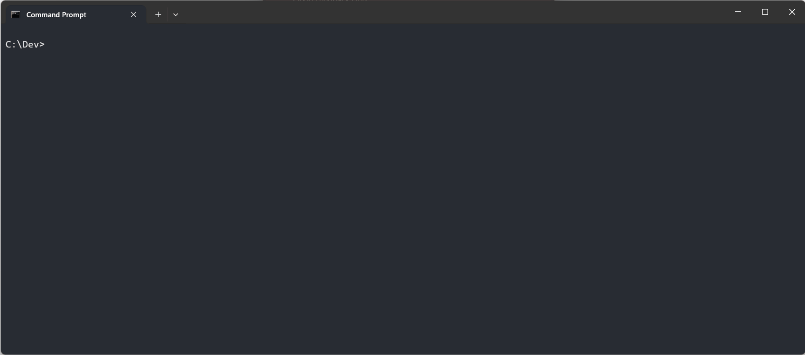
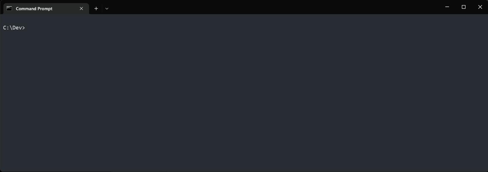
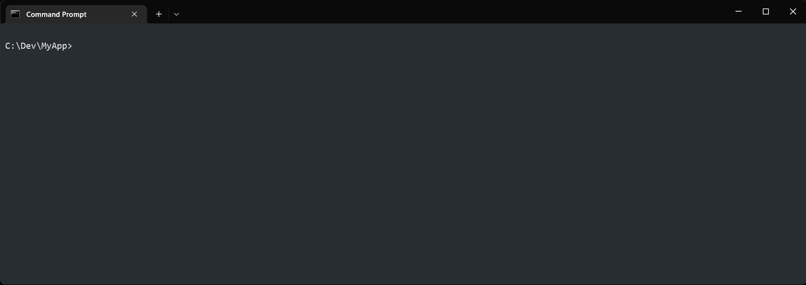

# Getting Started
The end goal is to have Soup running on all three major operating systems, and building for any target. However, because I do not have access to a Mac device we only support Linux and Windows today.

## Requirements

<details>
<summary>Linux</summary>

* Ubuntu 24.04
* Build Tools
  * `sudo apt install build-essential`

</details>

<details>
<summary>Windows</summary>

* Windows 11
* Build Tools
  * [Visual Studio 2022](https://visualstudio.microsoft.com/downloads/) with "Desktop development with c++" workload.
  * OR
  * [Build Tools For Visual Studio 2022](https://visualstudio.microsoft.com/downloads/#build-tools-for-visual-studio-2022) with "c++ build tools" workload.

</details>

## Setup
You can either install Soup or download a reference the archive.

<details>
<summary>Linux</summary>

* Debian Package (recommended)
  ```bash
  wget https://github.com/soup-build/soup/releases/latest/download/soup-build-amd64.deb
  sudo apt install ./soup-build-amd64.deb
  rm soup-build-amd64.deb
  ```

* Archive

  Download the soup-build-linux-x64.tar.gz archive from the [Latest Release](https://github.com/soup-build/soup/releases/latest). 

  Decompress the Soup release somewhere safe and add it to your path in a command prompt.

  ```bash
  export PATH=$PATH;~/soup/bin/
  ```

</details>

<details>
<summary>Windows</summary>

* Winget (recommended)
  ```cmd
  winget install SoupBuild.Soup
  ```

  

* Installer

  Download and run the SoupBuild.msi installer from the [Latest Release](https://github.com/soup-build/soup/releases/latest). 

  > Note: The installer is signed signature may not be trusted yet and you will have to ignore some scary warnings. When Microsoft receives enough trusted notifications this will no longer be necessary. 

* Archive

  Download the soup-build-windows-x64.zip archive from the [Latest Release](https://github.com/soup-build/soup/releases/latest). 

  Unzip the Soup release somewhere safe and add it to your path in a command prompt.

  ```cmd
  set PATH=%PATH%;C:\Soup\bin\
  ```
  Or add it to the "Path" System Environment Variable to always have it available!

</details>

## Setup SDKs
Use the SWhere tool to find the latest installed version of the SDKs on your local machine (listed in the dependencies list).

```
swhere
```


## Create First Project
Run Initialize command to create a new project!
```cmd
mkdir MyApp
cd MyApp
soup init
```



## Build First Project
```cmd
soup build
```



## Run First Project
```cmd
soup run
```


## Enjoy!
Check out the other [Samples](samples.md).
