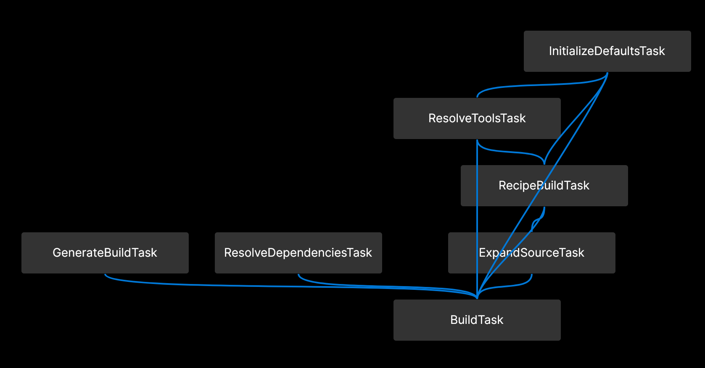
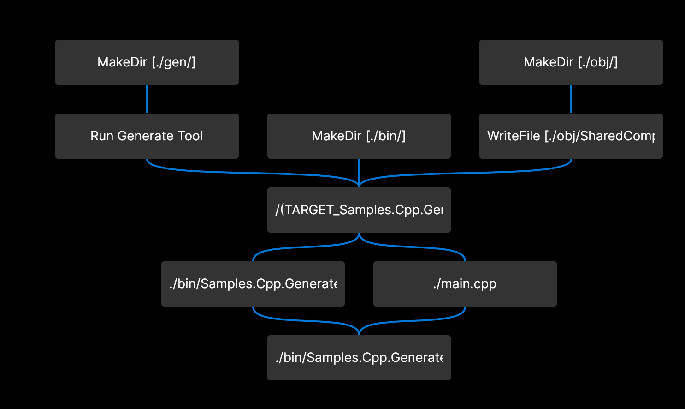

# C++ Generate File
Sample build tool and extension that generates a translation unit and injects it into the normal build process. The custom build task will run before the core Build Task and will create an Operation that generates a new translation unit and properly registers it as a normal source file for the compiler.


**Image showing updated task graph with the injected GenerateBuildTask**


**Image showing updated operation graph with the injected mkdir and generate file operations**

[Source](https://github.com/soup-build/soup/tree/main/samples/cpp/generate)

## [tool/recipe.sml](https://github.com/soup-build/soup/blob/main/samples/cpp/generate/tool/recipe.sml)
The Recipe file that defines the executable "samples-cpp-generate-tool" that will be run as part of the build.
```sml
Name: 'samples-cpp-generate-tool'
Language: 'C++|0'
Type: 'Executable'
Version: 1.0.0
```

## [tool/package-lock.sml](https://github.com/soup-build/soup/blob/main/samples/cpp/generate/tool/package-lock.sml)
The package lock that was generated to capture the unique build dependencies required to build this project.

## [tool/main.cpp](https://github.com/soup-build/soup/blob/main/samples/cpp/generate/tool/main.cpp)
A simple tool that writes a hard coded module interface unit to a provided source file during the build.
```cpp
#include <iostream>
#include <fstream>

std::string_view GenerateContent()
{
	// Maybe do something more interesting here
	return R"(module;

// Include all standard library headers in the global module
#include <string>

export module Sample.Generate;

export class Helper
{
public:
	static std::string_view GetName()
	{
		return "Soup";
	}
};)";
}

void PrintUsage()
{
	std::cout << "gen [path]" << std::endl;
}

int main(int argc, char** argv)
{
	if (argc != 2)
	{
		PrintUsage();
		return 1;
	}

	auto file = argv[1];
	auto genFile = std::ofstream(file);

	if (!genFile.is_open()) {
		std::cerr << "Error opening file!" << std::endl;
		return 1;
	}

	genFile << GenerateContent() << std::endl;

	genFile.close();

	return 0;
}
```

## [extension/recipe.sml](https://github.com/soup-build/soup/blob/main/samples/cpp/generate/extension/recipe.sml)
The Recipe file that defines the build extension dynamic library "samples-build-extension-extension" that will register new build tasks.
```sml
Name: 'samples-build-extension-extension'
Language: 'Wren|0'
Version: 1.0.0
Dependencies: {
  Runtime: [
    'soup|build-utils@0'
  ]
  Tool: [
    '../tool/'
  ]
}
```

## [extension/package-lock.sml](https://github.com/soup-build/soup/blob/main/samples/cpp/generate/extension/package-lock.sml)
The package lock that was generated to capture the unique dependencies required to build this project.

## [extension/generate-build-task.wren](https://github.com/soup-build/soup/blob/main/samples/cpp/generate/extension/generate-build-task.wren)
A Wren file defining a custom build Task that will run before the build definition and creates a build operation that will generate the source file. The task will also register this new file as a part of the full set of compilation inputs so it will be compiled in order the same as all other translation units.
```wren
// <copyright file="generate-build-task.wren" company="Soup">
// Copyright (c) Soup. All rights reserved.
// </copyright>

import "soup" for Soup, SoupTask
import "soup|build-utils:./path" for Path
import "soup|build-utils:./list-extensions" for ListExtensions
import "soup|build-utils:./map-extensions" for MapExtensions
import "soup|build-utils:./shared-operations" for SharedOperations

class GenerateBuildTask is SoupTask {
	/// <summary>
	/// Get the run before list
	/// </summary>
	static runBefore { [
		"BuildTask"
	] }

	/// <summary>
	/// Get the run after list
	/// </summary>
	static runAfter { [] }

	/// <summary>
	/// Core Evaluate
	/// </summary>
	static evaluate() {
		Soup.info("Running Before Build!")

		// Get the build table
		var buildTable = MapExtensions.EnsureTable(Soup.activeState, "Build")

		var contextTable = Soup.globalState["Context"]
		var targetRoot = Path.new(contextTable["TargetDirectory"])

		var generateDirectory = Path.new("gen/")
		var generateFile = generateDirectory + Path.new("helper.cpp")
		var generateFileAbsolute = targetRoot + generateFile

		// Ensure the generate folder exists
		var createGenerateDirectory = SharedOperations.CreateCreateDirectoryOperation(
			targetRoot,
			generateDirectory)
		Soup.createOperation(
			createGenerateDirectory.Title,
			createGenerateDirectory.Executable.toString,
			createGenerateDirectory.Arguments,
			createGenerateDirectory.WorkingDirectory.toString,
			ListExtensions.ConvertFromPathList(createGenerateDirectory.DeclaredInput),
			ListExtensions.ConvertFromPathList(createGenerateDirectory.DeclaredOutput))

		// Create the generate operation
		GenerateBuildTask.CreateGenerateFileOperation(targetRoot, generateFile)

		var generatedSourceInfo = {}
		generatedSourceInfo["File"] = generateFileAbsolute.toString
		generatedSourceInfo["IsInterface"] = true
		generatedSourceInfo["Module"] = "Samples.Cpp.GenerateFile"
		generatedSourceInfo["Imports"] = []

		var sourceFiles = [
			generatedSourceInfo
		]

		// Add the explicit source info for the generated file so we treat it like a normal
		// compiled translation unit
		ListExtensions.Append(
			MapExtensions.EnsureList(buildTable, "Source"),
			sourceFiles)
	}

	/// <summary>
	/// Create a build operation that will create a directory
	/// </summary>
	static CreateGenerateFileOperation(workingDirectory, generateFile) {
		// Discover the dependency tool
		var toolExecutable = SharedOperations.ResolveRuntimeDependencyRunExecutable("samples-cpp-generate-tool")

		var title = "Run Generate Tool"

		var program = Path.new(toolExecutable)
		var inputFiles = []
		var outputFiles = [generateFile]

		// Build the arguments
		var arguments = [generateFile.toString]

		Soup.createOperation(
			title,
			program.toString,
			arguments,
			workingDirectory.toString,
			ListExtensions.ConvertFromPathList(inputFiles),
			ListExtensions.ConvertFromPathList(outputFiles))
	}
}
```

## [application/recipe.sml](https://github.com/soup-build/soup/blob/main/samples/cpp/generate/application/recipe.sml)
The Recipe file that defines the executable "samples-cpp-generate-application". The one interesting part is the relative path reference to the custom build extension through "Build" Dependencies.
```sml
Name: 'samples-cpp-generate-application'
Language: 'C++|0'
Type: 'Executable'
Version: 1.0.0
Dependencies: {
  Build: [
    '../extension/'
  ]
}
```

## [application/package-lock.sml](https://github.com/soup-build/soup/blob/main/samples/cpp/generate/application/package-lock.sml)
The package lock that was generated to capture the unique build dependencies required to build this project.

## [application/main.cpp](https://github.com/soup-build/soup/blob/main/samples/cpp/generate/application/main.cpp)
A simple main method that prints our "Hello World, Soup Style!" by using the module from the generated file.
```cpp
#include <iostream>

import Sample.Generate;

int main()
{
	std::cout << "Hello World, " << Helper::GetName() << " Style!" << std::endl;
	return 0;
}
```

## [.gitignore](https://github.com/soup-build/soup/blob/main/samples/cpp/generate/.gitignore)
A simple git ignore file to exclude all Soup build output.