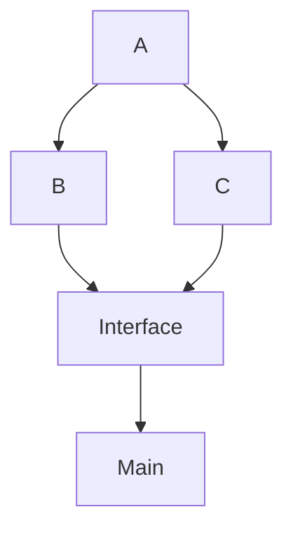

# C++ Module Partitions
A console application that uses a single module interface with multiple partitions used inside the same projects. This sample shows how the built in C++ scanner detects partitions internally to a package and builds these files in the correct order. This allows engineers to focus on the code itself without having to teach the build system about the dependency hierarchy so it can build modules.

This sample creates a diamond dependency to demonstrate exporting and importing from multiple partitions.



[Source](https://github.com/soup-build/soup/tree/main/samples/cpp/module-partitions)

## [recipe.sml](https://github.com/soup-build/soup/blob/main/samples/cpp/module-partitions/recipe.sml)
The Recipe file that sets the name, type, version, the public interface module and the single source file.
```sml
Name: 'samples-cpp-module-partitions'
Language: 'C++|0'
Type: 'Executable'
Version: 1.0.0
```

## [package-lock.sml](https://github.com/soup-build/soup/blob/main/samples/cpp/module-partitions/package-lock.sml)
The package lock that was generated to capture the unique build dependencies required to build this project.

## [helper-a.cpp](https://github.com/soup-build/soup/blob/main/samples/cpp/module-partitions/helper-a.cpp)
A module partition file that exports a single function.
```cpp
module;

// Include all standard library headers in the global module
#include <string>

export module Sample.ModulePartitions:HelperA;

export std::string_view Truncate(std::string_view value, size_t length)
{
	return value.substr(0, length);
}
```

## [helper-b.cpp](https://github.com/soup-build/soup/blob/main/samples/cpp/module-partitions/helper-b.cpp)
A module partition file that imports and exports a single function.
```cpp
module;

// Include all standard library headers in the global module
#include <string>

export module Sample.ModulePartitions:HelperB;
import :HelperA;

export std::string_view GetSourcePrefix()
{
	return Truncate("Source", 3);
}
```

## [helper-c.cpp](https://github.com/soup-build/soup/blob/main/samples/cpp/module-partitions/helper-c.cpp)
A module partition file that imports and exports a single function.
```cpp
module;

// Include all standard library headers in the global module
#include <string>

export module Sample.ModulePartitions:HelperC;
import :HelperA;

export std::string_view GetPackagesPostfix()
{
	return Truncate("packages", 1);
}
```

## [helper.cpp](https://github.com/soup-build/soup/blob/main/samples/cpp/module-partitions/helper.cpp)
A module interface file that exports a single sample class.
```cpp
module;

// Include all standard library headers in the global module
#include <string>

export module Sample.ModulePartitions;
import :HelperB;
import :HelperC;

export class Helper
{
public:
	static std::string GetName()
	{
		std::string result;
		result += GetSourcePrefix();
		result += GetPackagesPostfix();
		return  result;
	}
};
```

## [main.cpp](https://github.com/soup-build/soup/blob/main/samples/cpp/module-partitions/main.cpp)
A simple main method that prints our "Hello World, Soup Style!" by using the module from the previous file.
```cpp
#include <iostream>

import Sample.ModulePartitions;

int main()
{
  std::cout << "Hello World, " << Helper::GetName() << " Style!" << std::endl;
  return 0;
}
```

## [.gitignore](https://github.com/soup-build/soup/blob/main/samples/cpp/module-partitions/.gitignore)
A simple git ignore file to exclude all Soup build output.